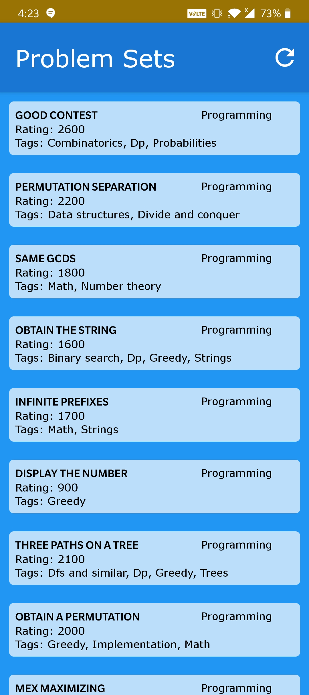
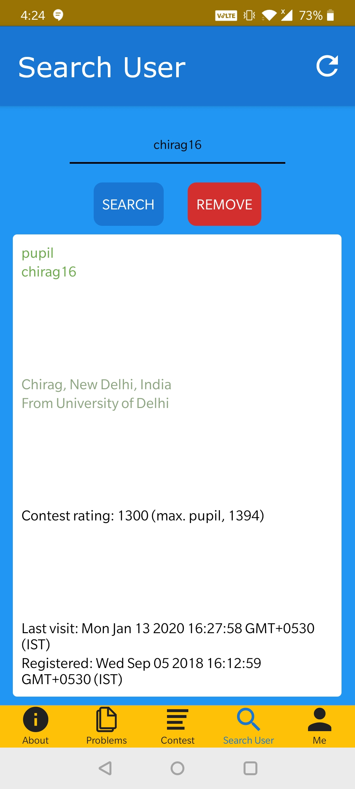

   

# Codeforces Watcher

## About

Codeforces watcher is an android application (not yet available on play store) which enables you to access codeforces on mobile phone easily and efficiently.  

Currently it supports the following features:
- Problem Sets (You can click on any of the problem to read it)
- Contest
- Search for users
- Track your ranking on codeforces 

[Details of available version](./Builds/README.md)

## Slack
You can [join the slack workspace](https://codeforceswatcher-322.slack.com) to discuss and provide feedback about the application.

## Screenshots

